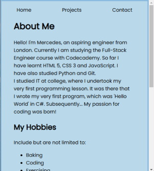

# Portfolio Project

## About

This is a Codecademy Portfolio Project. The purpose of this project is to show a collection of my work which demonstrates what I have learned so far, as well as my budding skills in HTML5, CSS3 and JavaScript. My portfolio consists of multiple pages, including a page where I demonstate some of the projects I have worked on with Codecademy.

## Features

My portfolio consists of three pages as well as a homepage. There is an About page which details some information about me including my hobbies and goals, a Projects page which displays a screenshot and an accompanying short message about each project, and a Contact page which shares some of my contact information, as well as my GitHub handle.

I used JavaScript to add different forms of interactivity to my website

## How to Use (To Be Updated)

## Technologies
The technologies used to create this portfolio are HTML5, CSS3, and JavaScript. Microsoft Visual Code enabled me to create all of my files and to bring them all together. I also used Git and GitHub to track and store my progress. Using a range of responive units and media queries, I was able to make my website responsive. Please see the an example below:

